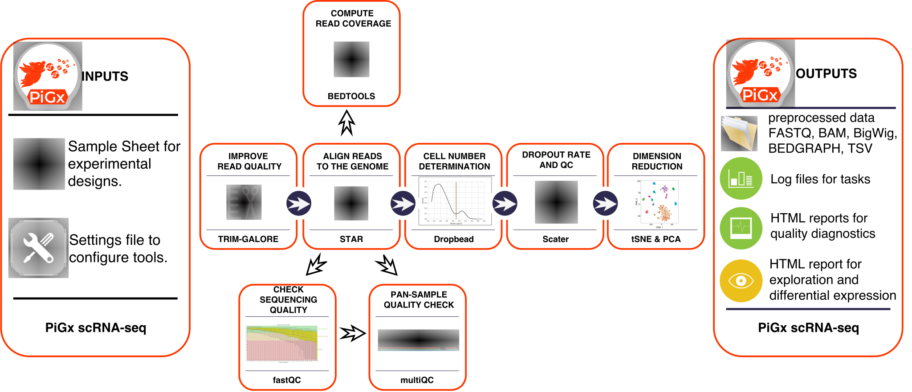

# pigx pipeline for single-cell RNAseq

<a name="logo"/>
<div align="center">
</img>
</a>
</div>

**Copyright 2017-2018: Vedran Franke, Bora Uyar, Ricardo Wurmus, Altuna Akalin.**
**This work is distributed under the terms of the GNU General Public License, version 3 or later.  It is free to use for all purposes.**

-----------


# Introduction

PiGX scRNAseq is an analysis pipeline for preprocessing and quality control for single cell RNA sequencing experiments. 
The inputs are read files from the sequencing experiment, and a configuration file which describes the experiment. 
It produces processed files for downstream analysis and interactive quality reports. 
The pipeline is designed to work with UMI based methods. It currently supports all methods which output paired
adapter - read files.
The pipeline was heavily influenced by the [Dropseq](http://mccarrolllab.com/dropseq/) pipeline from the McCaroll lab.


## What does it do

- Quality control reads using fastQC and multiQC
- Automatically determines the appropriate cell number
- Constructs the digital gene expression matrix
- Calculates per sample and per cell statistics
- Prepares a quality control report
- Normalizes data and does dimensionallity reduction


## What does it output

- bam files
- bigwig files
- UMI and read count matrices
- Quality control report
- SingleCellExperiment object with pre-calculated statistics and dimensionallity reductions

## PiGx - scRNA-seq workflow


_Figure 1: An overview of the PiGx scRNA-seq workflow_

# Install

At this time there are no ready-made packages for this pipeline, so
you need to install PiGx from source.

You can find the [latest
release](https://github.com/BIMSBbioinfo/pigx_scrnaseq/releases/latest)
here.  PiGx uses the GNU build system.  Please make sure that all
required dependencies are installed and then follow these steps after
unpacking the latest release tarball:

```sh
./configure                         \
    --prefix=/some/where            \
    DROPSEQJAR=/path/to/dropseq.jar \
    PICARDJAR=/path/to/picard.jar
make install
```

# Dependencies

By default the `configure` script expects tools to be in a directory
listed in the `PATH` environment variable.  If the tools are installed
in a location that is not on the `PATH` you can tell the `configure`
script about them with variables.  Run `./configure --help` for a list
of all variables and options.

You can prepare a suitable environment with Conda or with [GNU
Guix](https://gnu.org/s/guix).  

## Via Conda

- Download pigx_scrnaseq source code 
    - run: 
    > git clone https://github.com/BIMSBbioinfo/pigx_scrnaseq.git
- Download and install Anaconda from https://www.anaconda.com/download
- Locate the 'environment.yml' file in the source code. 
    - run:
    > conda env create -f environment.yml #provide path to the environment.yml file
    - activate the environment:
    > source activate pigx_scrnaseq 

## Via Guix

Assuming you have Guix installed, the following command spawns a
sub-shell in which all dependencies are available:

```sh
guix environment -l guix.scm
```

If you do not use one of these package
managers, you will need to ensure that the following software is
installed:

<details>
<summary>Software dependencies</summary>

</details>

# Getting started

To run PiGx on your experimental data, first enter the necessary parameters in the spreadsheet file (see following section), and then from the terminal type.
To run the pipeline, you will also need the appropriate genome sequence in fasta format, and the genome annotation in a 
gtf format.

```sh
$ pigx-rscnaseq [options] sample_sheet.csv -s settings.yaml
```

To see all available options type the `--help` option

```sh
$ pigx-scrnaseq --help

usage: pigx-scrnaseq [-h] [-v] -s SETTINGS [-c CONFIGFILE] [--target TARGET]
                   [-n] [--graph GRAPH] [--force] [--reason] [--unlock]
                   samplesheet

PiGx scRNAseq Pipeline.

PiGx scRNAseq is a data processing pipeline for single cell RNAseq read data.

positional arguments:
  samplesheet                             The sample sheet containing sample data in CSV format.

optional arguments:
  -h, --help                              show this help message and exit
  -v, --version                           show program's version number and exit
  -s SETTINGS, --settings SETTINGS        A YAML file for settings that deviate from the defaults.
  -c CONFIGFILE, --configfile CONFIGFILE  The config file used for calling the underlying snakemake process.  By
                                          default the file 'config.json' is dynamically created from the sample
                                          sheet and the settings file.
  --target TARGET                         Stop when the named target is completed instead of running the whole
                                          pipeline.  The default target is "final-report".  Pass "--target=help"
                                          to describe all available targets.
  -n, --dry-run                           Only show what work would be performed.  Do not actually run the
                                          pipeline.
  --graph GRAPH                           Output a graph in Graphviz dot format showing the relations between
                                          rules of this pipeline.  You must specify a graph file name such as
                                          "graph.pdf".
  --force                                 Force the execution of rules, even though the outputs are considered
                                          fresh.
  --reason                                Print the reason why a rule is executed.
  --unlock                                Recover after a snakemake crash.

This pipeline was developed by the Akalin group at MDC in Berlin in 2017-2018.
```


# The input parameters


## Sample Sheet

The sample sheet is a tabular file describing the experiment. The table has the following columns:

| name | reads1 | reads2 | library | covariate1 | covariate2 |
|------|--------|--------|---------|------------|------------|

- _name_ - name for the sample, which will be used to label the sample in all downstream analysis
- _reads1_ - fastq file containing the **adapter sequences**
- _reads2_ - fastq file containing the **sequenced reads**
  - location of these files is specified in `settings.yaml`
- _library_ - sequencing platform on which the experiment was performed (i.e. dropseq)
- _covariates_ - variables which describe the samples. For example: replicate, time, hour post infection, tissue ...

Additional columns may be included which may be used as covariates in the differential expression analysis (sex, age, different treatments).

## Settings File

The settings file is a _YAML_ file which specifies:

- Locations:
  - The locations of the reads (directory where `fastq` files are located)
  - The location of the output directory
  - The location of the `fasta` file with the reference genome (must be prepared by the user)
  - The location of a `GTF` file with genome annotations
- Genome assembly name (i.e. mm10)

- covariates 

In order to get started, enter `pigx-scrnaseq --init-settings my_settings.yaml`. This will create a file called `my_settings.yaml` with the default structure. The file will look like this:

```yaml
locations:
  output-dir: out/
  reads-dir: sample_data/reads/
  tempdir:

covariates: 'covariate1, covariate2, ...'

annotation:
  primary:
    genome:
      name: hg19
      fasta: sample_data/genome.fa
    gtf: sample_data/genome.gtf

execution:
  submit-to-cluster: no
  jobs: 6
  nice: 19
```

# Resource consideration

Single cell expression analysis is data intensive, and requires substantial computing resources. 
The pipeline uses the [STAR](https://github.com/alexdobin/STAR) aligner for read mapping, so the memory requirements will scale with the 
size of the genome. 
Please look at the [STAR](https://github.com/alexdobin/STAR) manual for the concrete number about the memory requirements.
For the human/mouse genome it requires ~ 40Gb of RAM. 
The pipeline produces temporary files which require a substantial amount of disk space. Please ensure
that you have at least 30Gb of disk space per 100 milion sequenced reads.
The location of the temporary directory can be controlled using the tempdir: variable in the settings.yaml.
By default the tempdir is set to **/tmp**.

**Important:** please make sure that the temporary directory has adequate free space


# Output directory structure
The output directory structure should look like the following tree

```
|-- Annotation
|   `-- genome_name (i.e. mm10)
|       `-- STAR_INDEX
|-- Log
|-- Mapped
|   |-- Sample_1
|   |   `-- genome_name
|   |-- Sample_2
|   |   `-- genome_name
|   |-- Sample_3
|   |   `-- genome_name
|   `-- Sample_4
|       `-- genome_name
```

### Annotation

Contains pre-processed fasta and gtf file, along with the STAR genome index.
The genome fasta file is processed into a dict header.
The gtf file has gene_names replaced with gene_id.

**Important**: We sincerely advise that you check that the gtf file corresponds to the same organism
and genome version as the genome fasta files.
The chromosome names have to completely correspond between the two files.

We encourage users to use both the genome annotation and the fasta file from the [ENSEMBL](https://www.ensembl.org/info/data/ftp/index.html) database.

### Log

Contains execution logs for every step of the pipeline.

### Mapped

The **Mapped** folder contains per sample processed single cell samples.
Additionally, it contains a [loom](http://linnarssonlab.org/loompy/) file with merged expression values from all experiments,
an RDS file with a saved [SingleCellExperiment](https://bioconductor.org/packages/release/bioc/html/SingleCellExperiment.html) object, and a quality control report in the html format.

#### Mapped/Sample1

Analaysis results for each sample are done in a separate subdirectory under **Mapped**.
Structure of analysis results:


```
|-- Sample1.fastq.bam
|-- Sample1_1_fastqc.html
|-- Sample1_1_fastqc.zip
|-- Sample1_2_fastqc.html
|-- Sample1_2_fastqc.zip
|-- genome_name
|   |-- adapter_trimming_report.txt
|   |-- Sample1_genome_name.bw
|   |-- Sample1_genome_name.m.bw
|   |-- Sample1_genome_name.p.bw
|   |-- Sample1_genome_name_BAMTagHistogram.txt
|   |-- Sample1_genome_name_DownstreamStatistics.txt
|   |-- Sample1_genome_name_READS.Matrix.txt
|   |-- Sample1_genome_name_ReadCutoff.png
|   |-- Sample1_genome_name_ReadCutoff.yaml
|   |-- Sample1_genome_name_ReadStatistics.txt
|   |-- Sample1_genome_name_Summary.txt
|   |-- Sample1_genome_name_UMI.Matrix.loom
|   |-- Sample1_genome_name_UMI.Matrix.txt
|   |-- polyA_trimming_report.txt
|   |-- star.Log.final.out
|   |-- star.Log.out
|   |-- star.Log.progress.out
|   |-- star.SJ.out.tab
|   |-- star_gene_exon_tagged.bai
|   |-- star_gene_exon_tagged.bam
|   |-- unaligned_tagged_Cellular.bam_summary.txt
|   `-- unaligned_tagged_Molecular.bam_summary.txt
```


#### Description of relevant output files:

- Sample1.fastq.bam - contains merged barcode and sequence fq files

- Sample1_genome_name.**bw** - bigWig file constructed from selected cells. Files with **m/p**.bw contain strand separated signal

- Sample1_genome_name_**BAMTagHistogram** - Number of reads in coressponding to each cell barcode.

- Sample1_genome_name_UMI.Matrix.**txt/loom** - UMI based digital expression matrix in txt and loom format

- Sample1_genome_name_READS.Matrix.txt - Read count digital expression matrix

- Sample1_genome_name_ReadCutoff.yaml - contains the UMI threshold for selecting high quality cells (obtained using [dropbead](https://github.com/rajewsky-lab/dropbead)). The corresponding .png file visualizes the UMI curve and the threshold.

- star_gene_exon_tagged.bam - mapped and annotated reads. Each read is tagged by annotation based on it's mapping location.

- Sample1_genome_name_**ReadStatistics/Downstream**.txt - quality control statistics used in the html report. They contain values such as number of reads in Exons/Introns.

# Downstream analysis

The combined expression data are subsequently processed into a [SingleCellExperiment](https://bioconductor.org/packages/release/bioc/html/SingleCellExperiment.html) object. SingleCellExperiment is a Bioconductor class for storing expression values, along with the cell, and gene data, and experimental meta data in a single container. It is constructed on top of hdf5  file based arrays  (Pagès 2017), which enables exploration even on systems with limited memory capacity. 
During the object construction, the pipeline performs expression normalization, dimensionallity reduction, identification of significantly variable genes, assigns the cells to the steps of the cell cycle, and calculates the quality statistics. The SingleCellExperiment object contains all of the necessary data needed for further exploration. The object connects the pigx-pipeline with the Bioconductor single cell computing environment, and enables integration with state of the art statistical, and machine learning mehods ([scran](https://bioconductor.org/packages/release/bioc/html/scran.html), [zinbwave](https://bioconductor.org/packages/release/bioc/html/zinbwave.html), [netSmooth](https://github.com/BIMSBbioinfo/netSmooth), [iSEE](https://github.com/csoneson/iSEE).


### Cluster Execution

The `execution` section in the settings file allows the user to specify whether the pipeline is to be submitted to a cluster, or run locally, and the degree of parallelism. For a full list of possible parameters, see `etc/settings.yaml`.

# Example

An example can be found in the `tests` directory.  The
`sample_sheet.csv` file here specifies the following sample data:

 
----------------------------------------
2018
