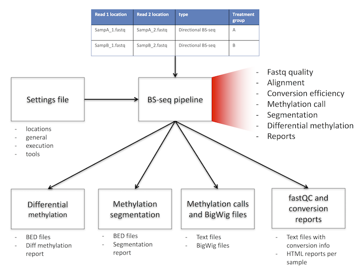

<a name="logo"/>
<div align="center">
</img>
</a>
</div>

**Copyright 2017: Alexander Gosdschan, Katarzyna Wreczycka, Bren Osberg.**
**This work is distributed under the terms of the GNU General Public License, version 3 or later.  It is free to use for all purposes.**

-----
# Summary

PIGx is a data processing pipeline for raw fastq read data of bisulfite experiments; it produces reports on aggregate methylation and  coverage and can be used to produce information on differential methylation and segmentation. It was first developed by the Akalin group at MDC in Berlin in 2017.

The figure below provides a sketch of the process.


# Getting started
PIGx can be installed through Guix (TODO: add details here) and consists of the following scripts: 

| File          | Purpose       |
| ------------- |:-------------:|
| PIGx_BS.sh    |: (main shell script) - establishes config file, links to input, reference paths and launches. |
| [TableSheet].csv  |: (primary input file)  spreadsheet supplying basic parameters of the process: (e.g. filenames, paths, etc.) |
| BSseq_pipeline.py |  Defines the rules of the pipeline for data processing.     |
| config.json   | Generated automatically by PIGx_BS.sh Defines various parameters; e.g. input/output folder paths, sample names, etc. |
| func_defs.py  | Subscript that defines various functions called in the main snakemake script.                          |

The rules defined in BSseq_pipeline are dependent on the following functions:
 - FASTQC                        
 - TRIMGALORE                   
 - CUTADAPT                      
 - BISMARK_GENOME_PREPARATION    
 - BISMARK                       
 - BOWTIE2                       
 - DEDUPLICATE_BISMARK           
 - BISMARK_METHYLATION_EXTRACTOR 
 - BISMARK2REPORT                
 - SAMTOOLS 

All of these dependencies must be present in folder indicated in the config.json file by  ["paths"]["GTOOLBOX"]. TODO: dependencies (talk to RW)

There are additional dependencies that do need to be installed, but not located in ["paths"]["GTOOLBOX"]:

 - [python-rp2](https://rpy2.bitbucket.io/)
 - [pandoc](http://pandoc.org/)
 - [methylKit](https://github.com/al2na/methylKit)[>=1.3.1]
 - [genomation](http://bioinformatics.mdc-berlin.de/genomation/)
 - [DT](https://rstudio.github.io/DT/) 
 - [annotationhub](https://www.bioconductor.org/packages/release/bioc/html/AnnotationHub.html)
 - [rtracklayer](http://bioconductor.org/packages/release/bioc/html/rtracklayer.html)
 - [rmarkdown](http://rmarkdown.rstudio.com/)[>=1.5]

To run PIGx on your experimental data, first enter the necessary parameters in the spreadsheet file (see following section), and then from the terminal type

```
$ PIGx.x [options] 
```

Upon doing so, the folder specified by "PATHOUT" in the input table will be created in addition to several subdirectories.
Most of these directories correspond to various stages of completion in the data-processing pipeline; however one additional folder will be called path_links/.
In this folder, symbolic links will be established that point directly to the reference genome and input files used for the calculation --provided they don't already exist. If they *do* already exist, then they will NOT be updated, and warnings to this effect will be suppressed. For this reason, you must BE CAREFUL WHEN RENAMING FILES IN THE INPUT FOLDER.
If, for example, you rename an input file to a name that has already been used (e.g. if you have "Sample1.fq.gz", "Sample2.fq.gz", and then delete Sample1 and decrement the names of subsequent files) or if you modify an extension (e.g. from ".fastq" to the standard ".fq") then the link can persist despite pointing to the wrong data.
If you absolutely must rename input files after having already run PiGx once, then go into ../PATHOUT/path_links/input/ and delete the corresponding links so that they can be generated from scratch automatically the next time PiGx is run. You have been warned.


---- 
# Input parameters

The input parameters specifying the desired behaviour of PIGx should be entered into the file Samplesheet.
When PIGx is run, the data from this file will be used to automatically generate a configuration file with the following values:
 
| Variable name | default value | description |
| ------------- |:-------------:|:-----------:|
| NICE          |    19         | integer: from -20 to 19; higher values make the program execution less demanding on computational resources |
| bismark_args  |  " --multicore 2 -N 1 -L 2 "      |  string: optional arguments supplied to bismark during alignment. See the [Bismark User Guide](https://rawgit.com/FelixKrueger/Bismark/master/Docs/Bismark_User_Guide.html#appendix-ii-bismark)  |
| SAMPLES       |     --        | struct: list of all the samples to be considered. |
|  files        |     --        | string(s): part of SAMPLE: lists files (without extension) to read. when 2 are specified, paired-end is assumed, otherwise, single end. |
|  PATHIN       |     ---       | string: location of the experimental data files (.fastq[.gz|.bz2])   |
|  PATHOUT      |    "./"       | string: ultimate location of the output data and report files   |
|  GENOMEPATH   |     ---       | string: location of the reference genome data for alignment   |
|  GTOOLBOX     | "~/.guix-profile/bin/"  | string: executable source files for the PIGx dependencies   |

 
All input files (paired or single end) must be present in the foler indicated by _PATHIN_, And must have their files listed among ["SAMPLES"]. Output from the snakemake script will then be sent to the folder indicated by ["paths"]["PATHOUT"], with subdirectories corresponding to the various stages of the process.


The folder indicated by ["paths"]["GENOMEPATH"] must contain the reference genome being mapped to.

