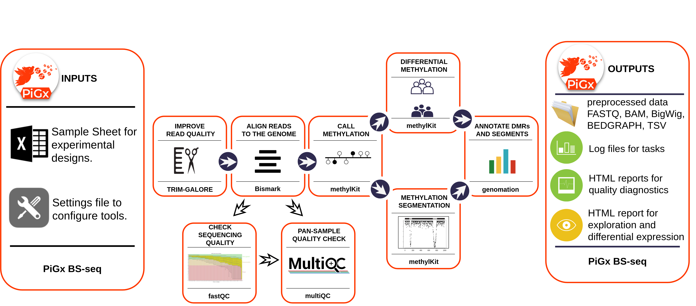

<a name="logo"/>
<div align="center">
</img>
</a>
</div>

**Copyright 2017-2021: Alexander Blume, Katarzyna Wreczycka, Bren Osberg, Ricardo Wurmus.**
**This work is distributed under the terms of the GNU General Public License, version 3 or later.  It is free to use for all purposes.**

-----
# Summary

PiGx BSseq is a data processing pipeline for raw fastq read data of bisulfite experiments; it produces reports on aggregate methylation and coverage and can be used to produce information on differential methylation and segmentation. It was first developed by the Akalin group at MDC in Berlin in 2017.

The figure below provides a schematic of the process.



# Install

You can install this pipeline with all its dependencies using GNU Guix:

    guix package -i pigx-bsseq

You can also install it from source manually.  PiGx BSseq uses the GNU
build system.  If you want to install PiGx BSseq from source (you can
find the [latest release
here](https://github.com/BIMSBbioinfo/pigx_bsseq/releases/latest)),
please make sure that all required dependencies are installed and then
follow these steps after unpacking the latest release tarball:

```sh
./configure --prefix=/some/where
make install
```

# Dependencies

By default, the `configure` script expects tools to be in a directory
listed in the `PATH` environment variable. For reproducibility
We recommend installing the necessary tools with 
[GNU Guix](https://gnu.org/s/guix). If the tools are installed in a 
location that is not on the `PATH` you can tell the `configure`
script about them with variables.  Run `./configure --help` for a list
of all variables and options.

<details>
  <summary>The following tools must be available:</summary>

 - fastqc
 - trim_galore
 - cutadapt
 - bismark_genome_preparation
 - deduplicate_bismark
 - bismark
 - bowtie2
 - bwa-meth
 - bwa
 - methyldackel
 - samblaster
 - multiqc
 - samtools [>=1.3]
 - snakemake
 - Python [>=3.5]
 - PyYAML
 - [pandoc](http://pandoc.org/)
 - [pandoc-citeproc](http://pandoc.org/)
 - R
 - [methylKit](https://github.com/al2na/methylKit) [>=1.3.1]
 - [genomation](http://bioinformatics.mdc-berlin.de/genomation/)
 - [DT](https://rstudio.github.io/DT/) 
 - [annotationhub](https://www.bioconductor.org/packages/release/bioc/html/AnnotationHub.html)
 - [rtracklayer](http://bioconductor.org/packages/release/bioc/html/rtracklayer.html)
 - [rmarkdown](http://rmarkdown.rstudio.com/) [>=1.5]
 - ggplot2
 - ggbio
 - ggrepel
 - reshape2
 - matrixstats
 - data-table

All of these dependencies must be present in the environment at
configuration time.
</details>


## Installation of dependencies via Guix

Rather than installing all required packages manually, we generally
recommend using [GNU Guix](https://gnu.org/s/guix).  The following
command spawns a sub-shell in which all dependencies are available:

```sh
guix environment -l guix.scm
```

# Getting started

To run PiGx BSseq on your experimental data, first enter the 
necessary parameters in the spreadsheet file (see following section), 
and configure the appropriate settings in `settings` files; 
then, from the terminal type:

```sh
$ ./pigx-bsseq [options] sample_sheet.csv -s settings.yaml
```

To see all available options add the `--help` option to the above command

```sh
$ ./pigx-bsseq --help

usage: pigx-bsseq [-h] [-v] -s SETTINGS [-c CONFIGFILE] [--target TARGET] [-n] [--graph GRAPH] [--force] [--reason]
                  [--unlock]
                  sample_sheet

PiGx BSseq Pipeline.

PiGx BSseq is a data processing pipeline for raw fastq read data of
bisulfite experiments.  It produces methylation and coverage
information and can be used to produce information on differential
methylation and segmentation.

positional arguments:
  sample_sheet                             The sample sheet containing sample data in CSV format.

optional arguments:
  -h, --help                              show this help message and exit
  -v, --version                           show program's version number and exit
  -s SETTINGS, --settings SETTINGS        A YAML file for settings that deviate from the defaults.
  -c CONFIGFILE, --configfile CONFIGFILE  The config file used for calling the underlying snakemake process.  By
                                          default the file 'config.json' is dynamically created from the sample
                                          sheet and the settings file.
  --target TARGET                         Stop when the named target is completed instead of running the whole
                                          pipeline.  The default target is "final-report".  Pass "--target=help"
                                          to describe all available targets.
  -n, --dry-run                           Only show what work would be performed.  Do not actually run the
                                          pipeline.
  --graph GRAPH                           Output a graph in PDF format showing the relations between rules of
                                          this pipeline.  You must specify a graph file name such as
                                          "graph.pdf".
  --force                                 Force the execution of rules, even though the outputs are considered
                                          fresh.
  --reason                                Print the reason why a rule is executed.
  --unlock                                Recover after a snakemake crash.
  --verbose                               Print supplementary info on job execution.
  --printshellcmds                        Explicitly print commands being executed by snakemake to standard out.


This pipeline was developed by the Akalin group at MDC in Berlin in 2017-2018.
```

# Input Parameters

The pipeline expects two kinds of input: a sample sheet in CSV format and a
settings file specifying the desired behaviour of PiGx BSseq.  PiGx BSseq will
automatically generate a JSON configuration file from these inputs.

## Sample Sheet

The sample sheet is a table with sample-specific information
containing the names of fastq files, unique sample ids, the type of
bisulfite sequencing experiment (such as RRBS or WGBS, currently, 
only WGBS is available) and treatment group for differential methylation
detection.

An example sample sheet is provided in tests/sample_sheet.csv and contains
the following:

```
Read1,Read2,SampleID,Protocol,Treatment
PE_1.fq.gz,PE_2.fq.gz,PEsample,WGBS,0
SE_techrep1.fq.gz,,SEsample,WGBS,1
SE_techrep2.fq.gz,,SEsample_v2,WGBS,2
```

In the same folder, `sample\_sheet.ods` is provided to allow for input 
specification in the Libre Office Spreadsheet package, or similar 
Excel-like programs. Once this spreadsheet is saved, select 
`Save As`-> `Text CSV (.csv)`, and select the option to edit filters 
to ensure that fields are separated by a comma (i.e. `Field delimiter = ','`)

## Settings File

The default settings file can be found at `etc/settings.yaml`; the values
here are used for any settings that are not specified by the user in the main
settings file (which override the defaults).  An example settings file is 
provided in tests/settings.yaml with the following content 

```
locations:
  input-dir: in/
  output-dir: out/
  genome-dir: genome/

general:
  assembly: hg19
  methylation-calling:
    minimum-coverage: 0
    minimum-quality: 10
  differential-methylation:
    cores: 20
    treatment-groups:
      - ['0', '1']
      - ['0', '2']
    annotation:
      cpgIsland_bedfile: genome/cpgIslandExt.hg19.bed.gz
      refGenes_bedfile:  genome/refGene.hg19.bed.gz
      webfetch:   no

execution:
  submit-to-cluster: no
  jobs: 6
  nice: 19
  cluster:
    memory: 8G
    stack: 128M
    queue: all
    contact-email: none
```

Note that indentation implies hierarchical structure; the significance
of each section is discussed below.

## Available settings

PiGx BSseq recognizes four sections in the settings file:

- `locations` for input, output, and genome directories
- `general` for general settings
- `execution` for settings affecting the pipeline execution

### Locations

| Variable name | description |
| ------------- |:-----------:|
| input-dir     | string: location of the experimental input data files (currently requires .fastq.gz) |
| output-dir    | string: ultimate location of the output data and report files   |
| genome-dir    | string: location of the reference genome data for alignment   |

All input files (paired- or single-end) must be present in the folder
`input-dir`. All output produced by the pipeline will be written to the folder
`output-dir`, with subdirectories corresponding to the various stages of the
process. The directory `genome-dir` must contain the reference genome being
mapped to. If `genome-dir` contains a pre-existing sub-directory called
`Bisulfite\_Genome`, then the bisulfite-converted genome contained therein will
be used for mapping. If this sub-directory does not exist, then the pipeline
will perform this conversion itself (and will require permission to write to
disk at the location `genome-dir` in order to create this sub-directory,
otherwise an error will be raised.)


### General

```
general:
  assembly: hg19
  methylation-calling:
    minimum-coverage: 0
    minimum-quality: 10
  differential-methylation:
    cores: 20
    treatment-groups:
      - ['0', '1']
    annotation:
      cpgIsland_bedfile: genome/cpgIslandExt.hg19.bed.gz
      refGenes_bedfile:  genome/refGene.hg19.bed.gz
      webfetch:   no
```

| Variable name | description |
| ------------- |:-----------:|
| assembly      | string: UCSC assembly release name e.g. "hg19"
| methylation-calling:minimum-coverage | integer: Minimum read coverage to be included in the methylKit objects. Defaults to 1. Any methylated base/region in the with fewer hits than this value will be ignored.
| methylation-calling:minimum-quality | integer: Minimum phred quality score to call a methylation status for a base.  Defaults to 10.
| differential-methylation:cores | integer: Denotes how many cores should be employed in parallel differential methylation calculations
| differential-methylation:treatment-groups | Array of strings indicating which groups (the "Treatment" column in the sample sheet) ought to be compared against one-another in differential methylation. The index corresponding to the control group must be entered first, followed by the 'treatment' under consideration. If differential methylation is to be omitted, remove this variable entirely from the settings file.
| differential-methylation:annotation | Annotation files for differential methylation, based on CpG islands and reference genes respectively.  
| webfetch   | Boolean: Should pigx download these annotation files from the internet if they are not found in the locations specified? (if `no`, then these sections are simply ommitted.)

### Execution

```
execution:
  submit-to-cluster: no
  jobs: 6
  nice: 19
  cluster:
    memory: 8G
    stack: 128M
    queue: all.q
    contact-email: none
```

| Variable name         | description |
| --------------------- |:-----------:|
| submit-to-cluster     | string: Whether the pipeline should run locally ("no") or on a cluster with an SGE queueing system ("yes").
| jobs                  | string: Number of jobs sent to cluster, e.g. "6"
| nice                  | integer: From -20 to 19; higher values make the program execution less demanding on computational resources
| cluster:memory        | string: Amount of memory used for all jobs besides bismark, e.g. "8G"
| cluster:stack         | string: Stack size limit (used for cluster jobs), e.g. "128m"
| cluster:contact-email | string: Email address where information about pipelines progress is sent (if it is running on a cluster).


Further values can be supplied. For example, should the user wish to allocate
job submission onto a specific queue (which we will call **X**) for  _all_
rules being executed, they may set:

```
execution:
  ...
  cluster:
    queue:  X
  ...
...
```

Or certain rules can be allocated to specific queues as follows:

```
execution:
  ...
  rules:
    __default__:
      queue: X
    bismark_align_and_map_se:
      queue: Y
    ...
...
```
In the latter case, the `__default__` rule must be defined, and there may not
be any multiply-defined variables.

### Tools

The values for the `executable` field for each tool are determined at
configure time and usually won't have to be changed unless you want to
experiment with a custom variant of a particular tool.

The `args` field for each tool accepts a string for additional
arguments to be passed to the specified tool.

The `bismark` tool supports additional settings, such as `cores` (the
number of cores used by bismark) and `memory` for the amount of RAM
that bismark may use.

# Running the pipeline

Once the sample sheet and settings file have been prepared, it may be useful to
submit the pipeline with the `dry-run` argument shown above, to confirm
execution will run. Once a run is submitted using the commands above, the 
`config.json` file will be automatically generated, and the unicode `PiGx` 
logo should appear.  Sub-diretories will also be created in the
output folder with names that are (approximately) sequentially-ordered to
indicate their place in the sequence of operations. 
If a run is interuppted, it may be necessary to run the
submission script with the option `--unlock` before resuming from where the
previous run was terminated. PiGx generates its own documentation to screen
during execution, however, the underlying process based on snakemake will
produce further updates to screen showing the status of the run. Within each
subfolder, further programs will generate their own log files that can be
consulted in case debugging is necessary (e.g. if a run fails with a cryptic
error message, and the output directory contains folders named `01_*`, 
`02_*`,  `03_*`, etc., we recommend reading the last few lines of the 
`*.log` files in the last directory to be created.)

